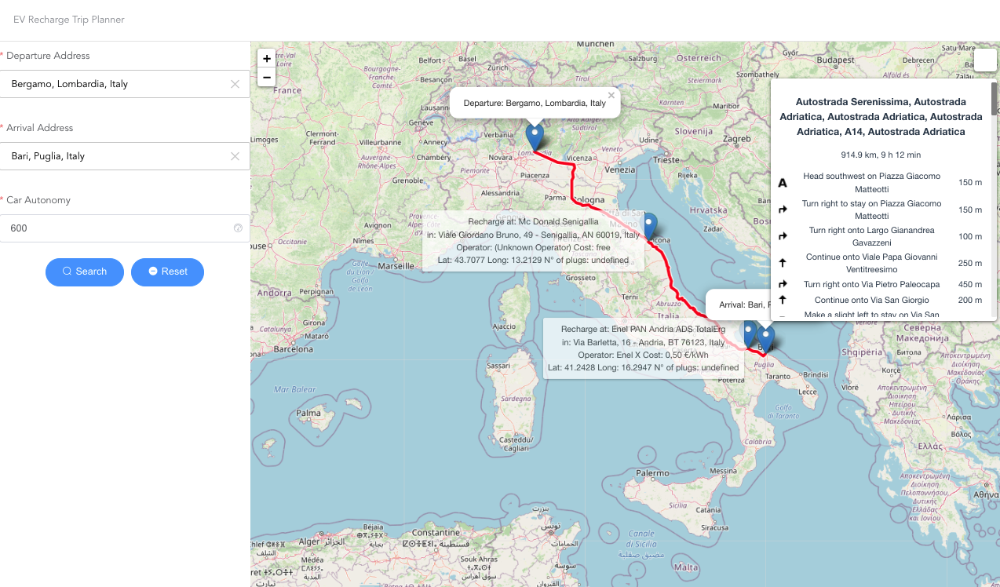
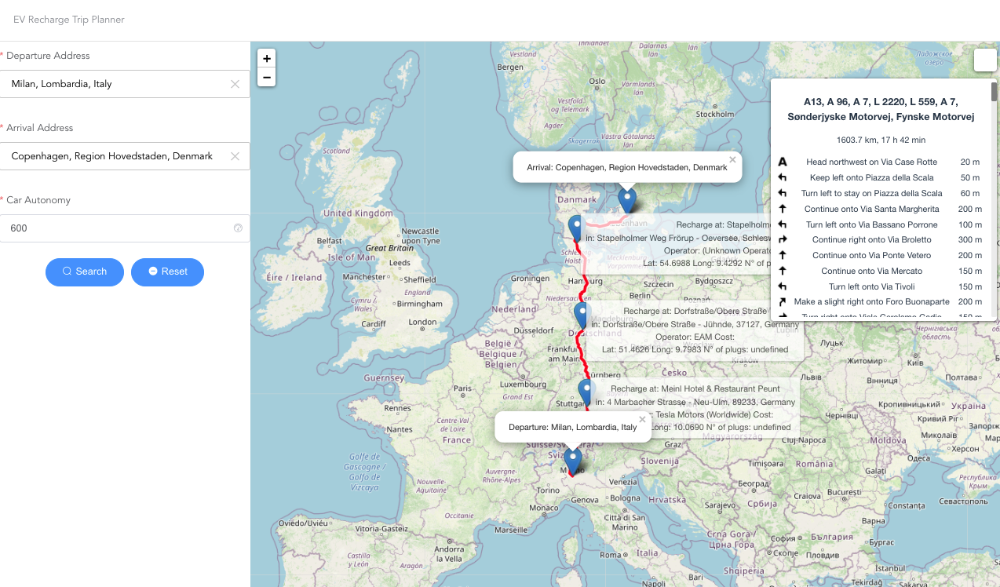
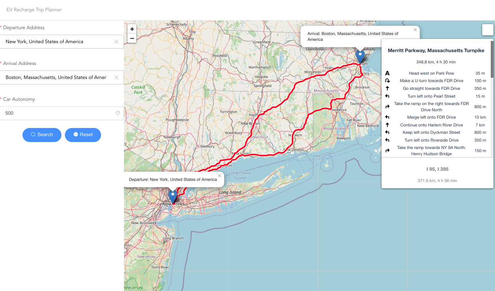
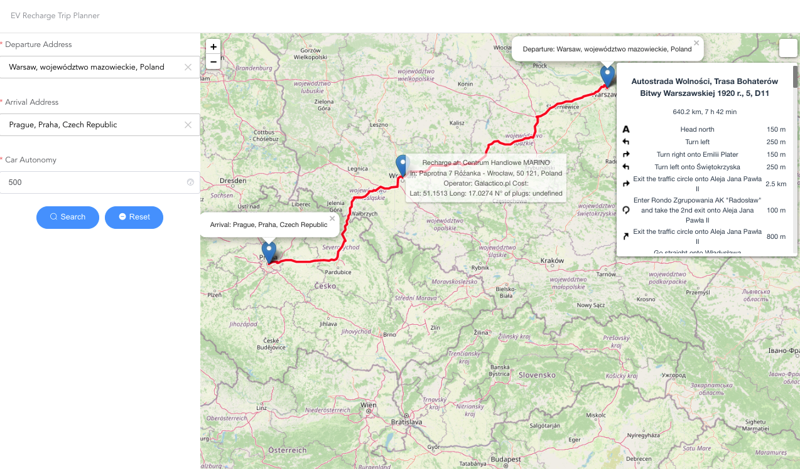
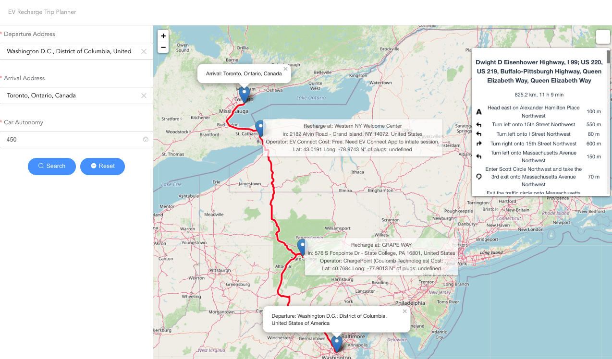

# EV Route Planner

This is a simple route planner for EV charging stations. Given a departure location, a destination and the autonomy in km of the electical vehicle fully charged, it will return the optimal route to the destination with intermediate stops at the displayed charging stations. Consumes OpenChargeMap API and OpenStreetMap API from the leaflet library.

WebApp is served here: [formidablae-ev-route-planner.netlify.app](https://formidablae-ev-route-planner.netlify.app)

## Documentation

Documentation in Italian language is available here: [Documentazione_Informatica_III_Modulo_Progettazione_e_Algoritmi.pdf](./docs/pdf/Documentazione_Informatica_III_Modulo_Progettazione_e_Algoritmi_Anonimo.pdf)

## Visual state of the project








## Project setup
Works with npm version 13.0.0
```
npm install
```

### Compiles and hot-reloads for development
```
npm run serve
```

### Compiles and minifies for production
```
npm run build
```

### Run your tests
```
npm run test
```

### Lints and fixes files
```
npm run lint
```

### Customize configuration
See [Configuration Reference](https://cli.vuejs.org/config/).
